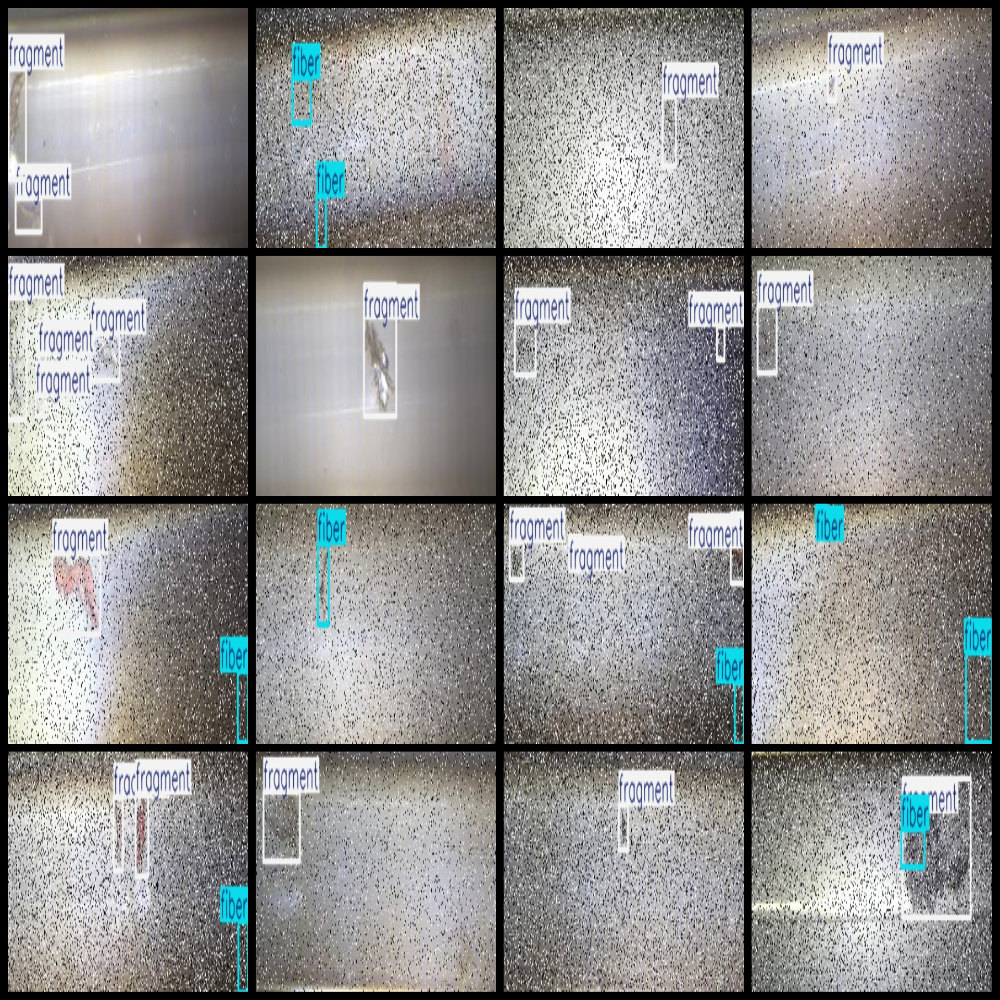
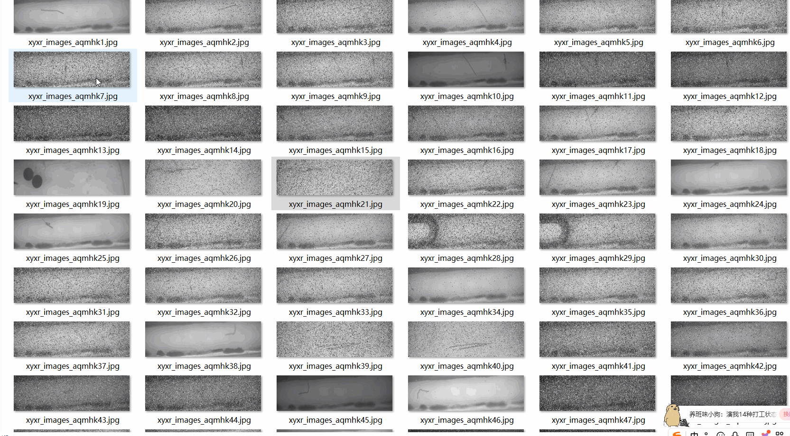

# Multi-Class Plastic Particles Detection Dataset - 11,997 Images in VOC+YOLO format

The multi-class plastic particulates detection dataset consists of 11,997 images in VOC+YOLO format.

The dataset is organized in three folders: JPEGImages, Annotations, and labels, each containing specific file types for image storage, XML annotation files, and textual data respectively. The JPEGImages folder contains a total of 11,997 jpg images, the Annotations folder includes 11,997 corresponding xml files, and the labels folder contains 11,997 text files.

The number of labeled categories is four: "dirt", "fiber", "fragment", and "pellet". The Chinese translations are provided as follows:

- "dirt": "Dirt"
- "fiber": "fiber"
- "fragment": "fragment"
- "pellet": "granule"

Each category has its respective number of bounding box (BBox) instances as per the order indicated by the labels folder's classes.txt file:

- dirt BBox count = 1,944
- fiber BBox count = 5,284
- fragment BBox count = 17,732
- pellet BBox count = 647

Total BBox count = 25,607

The image resolution is generally good, with typical pixel counts. The images have been enhanced.

Label shapes are rectangular boxes used for object detection recognition.

Special Note: No guarantees are made regarding the accuracy or precision of the models trained on this dataset or any weight files. This dataset is provided solely for accurate and reasonable annotation.

Special Disclaimer: This dataset does not guarantee the accuracy or precision of the training models or weight files. It is provided only for accurate and reasonable annotation.
## Images

---

Here is a pay link on Stripe (https://buy.stripe.com/3cs8yP7sY87d0vu9AB). Please contact me lonlonago@foxmail.com after funding $89, and I will send you a complete data files, thank you!

